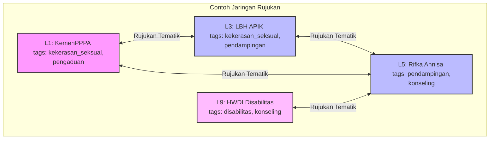
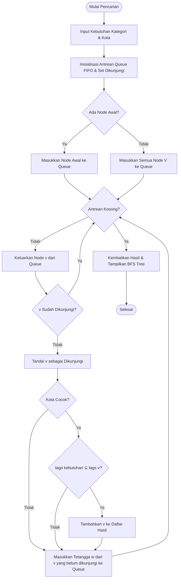

# KAUMITA: Pencarian Layanan Advokasi, Bantuan, dan Perlindungan Inklusif
> **Tugas Project Mata Kuliah Kecerdasan Buatan (IF-24) — Kelompok 10 Kelas C**
> - Azzaral Aswad Asshiddiqy (L0124090)
> - Daffa Dewanda Putra (L0124094)
> - Muhammad Raditya Boy W. (L0124109)

---

## 📌 Progress 3: Pemetaan Masalah Ke Model (*Problem to Model Mapping*)

Untuk memahami bagaimana masalah pencarian layanan inklusif di KAUMITA dapat diselesaikan menggunakan algoritma **Breadth-First Search (BFS)**, kita harus memetakan masalah dunia nyata ini ke dalam konsep formal **Kecerdasan Buatan (Search Problem)** dan **Struktur Data Graf**.

### 1. Formulasi Masalah Pencarian AI (5-Tuple *Search Problem*)

Dalam kecerdasan buatan, suatu masalah pencarian didefinisikan secara formal menggunakan 5 komponen utama (*5-tuple*):

| Komponen AI | Deskripsi Masalah Dunia Nyata (KAUMITA) | Implementasi Kode (`kaumita_bfs.py`) |
| :--- | :--- | :--- |
| **Ruang Keadaan**<br>*(State Space)* | Seluruh lembaga/layanan perlindungan yang terdaftar dalam sistem. Setiap keadaan (*state*) mewakili posisi pencarian pada satu lembaga tertentu. | Himpunan objek `Layanan` yang disimpan di dalam `LayananGraph.vertices` (berdasarkan data `layanan.csv`). |
| **Keadaan Awal**<br>*(Initial State)* | Lembaga pertama di mana pencarian rujukan dimulai. Jika tidak dibatasi, pencarian dimulai dari seluruh lembaga secara paralel (*multi-source*). | - Jika ditentukan: `node_awal_id` (misal: ID lembaga tertentu).<br>- Jika tidak ditentukan: Seluruh ID lembaga dimasukkan ke dalam antrean BFS di awal. |
| **Model Transisi**<br>*(Transition Model / Actions)* | Perpindahan dari satu lembaga ke lembaga lain melalui **jaringan rujukan**. Jaringan rujukan ini terbentuk jika kedua lembaga memiliki keahlian/kategori layanan yang beririsan (kesamaan tag). | Membaca relasi tetangga dari adjacency list `LayananGraph.edges[v]`. Tetangga dibentuk apabila $\text{tags}(u) \cap \text{tags}(v) \neq \emptyset$. |
| **Uji Tujuan**<br>*(Goal Test)* | Memeriksa apakah lembaga yang sedang dikunjungi memenuhi **seluruh** kebutuhan pengguna (kriteria tags) dan berada di wilayah kota yang sesuai (atau berskala nasional). | Logika pada fungsi `memenuhi()` dan filter kota:<br>1. $U_{req} \subseteq A(v)$ (Kebutuhan pengguna adalah subset dari tag lembaga).<br>2. $\text{kota}_v = \text{kota}_{user} \lor \text{kota}_v = \text{Nasional}$. |
| **Biaya Lintasan**<br>*(Path Cost)* | Jumlah langkah rujukan (*referral hops*) yang ditempuh untuk mencapai lembaga tujuan. Setiap transisi memiliki bobot yang sama ($cost = 1$). | Setiap pergeseran level/kedalaman (*depth level*) pada pohon BFS bernilai $+1$ rujukan. |

---

### 2. Representasi Graf $G = (V, E)$

Masalah KAUMITA dimodelkan sebagai graf tidak berarah dan tidak berbobot (*undirected, unweighted graph*):



* **Vertices (Node) $V$**:
  $$V = \{v_1, v_2, ..., v_n\}$$
  Setiap node $v$ merepresentasikan satu instansi layanan perlindungan (seperti LPSK, LBH APIK, Komnas Perempuan, dll.). Setiap node memiliki properti berupa nama, lokasi kota, kategori, dan himpunan tag ($A(v)$).

* **Edges (Sisi) $E$**:
  Hubungan rujukan antarnode dibentuk secara otomatis melalui kesamaan tag layanan:
  $$E = \{(u, v) \mid u, v \in V \land (tags(u) \cap tags(v) \neq \emptyset)\}$$
  Jika Lembaga A memiliki tag `["kekerasan_seksual", "konseling"]` dan Lembaga B memiliki tag `["konseling", "pendampingan"]`, maka terdapat hubungan rujukan (edge) antara A dan B karena mereka sama-sama menangani kasus `konseling`.

---

### 3. Keterkaitan Model dengan Pengimplementasian BFS

Algoritma **Breadth-First Search (BFS)** sangat tepat digunakan untuk model ini karena karakteristik utamanya:

1. **Prinsip Jalur Rujukan Terdekat (*Shortest Referral Hops*)**:
   BFS mengeksplorasi graf secara bertahap level demi level (menggunakan antrean **Queue FIFO**). 
   * **Level 0**: Lembaga awal itu sendiri.
   * **Level 1**: Lembaga yang merujuk langsung (tetangga tingkat 1).
   * **Level 2**: Lembaga yang dirujuk melalui perantara 1 lembaga lain (tetangga tingkat 2), dst.
   Dengan demikian, rekomendasi yang diberikan dijamin diurutkan berdasarkan kedekatan jaringan rujukan/kesamaan bidang layanan dari node awal.

2. **Pencarian Multi-Sumber (*Multi-Source BFS*)**:
   Jika pengguna tidak memiliki preferensi node awal, sistem akan memasukkan seluruh node ke dalam antrean di awal. BFS akan melakukan traversal untuk menyaring seluruh lembaga yang memenuhi kriteria *Goal Test*.

3. **Penyaringan Secara Dinamis (*Constraint Filtering*)**:
   Selama proses BFS berjalan (`while antrian:`), setiap node yang dikeluarkan dari antrean (`popleft`) akan langsung dievaluasi terhadap kriteria kota dan tag. Jika lolos evaluasi, node dimasukkan ke daftar hasil rekomendasi.

#### Visualisasi Alur Algoritma BFS pada Sistem KAUMITA



---

### 4. Contoh Penelusuran Jalur BFS (*Trace Simulation*)

Misalkan kita mencari lembaga dengan kriteria kebutuhan: **`["konseling", "perempuan"]`** di kota **`Surakarta`**.

1. **Inisialisasi**:
   - `kebutuhan` = `{"konseling", "perempuan"}`
   - `kota` = `"Surakarta"`
   - `antrian` = `[1, 2, 3, 4, 5, 6, 7, 8, 9, 10, ... 28]` (Multi-source BFS karena node awal kosong).
   - `dikunjungi` = `{}`
   - `hasil` = `[]`

2. **Iterasi Traversal (Beberapa Node Utama)**:
   * **Node 5** (Rifka Annisa Women's Crisis Center, Yogyakarta):
     * Tags: `{"kekerasan_seksual", "pendampingan", "perempuan", "pengaduan", "konseling"}`
     * *Goal Test*: `{"konseling", "perempuan"}` $\subseteq$ Tags? **Ya** (Memenuhi kriteria).
     * *Kota Filter*: Kota Yogyakarta $\neq$ Surakarta dan bukan Nasional. Maka **dilewati (tidak masuk hasil)**.
     * Ekspansi: Tetangga Node 5 dimasukkan ke antrean.
   * **Node 11** (SPEK-HAM Surakarta, Surakarta):
     * Tags: `{"kekerasan_seksual", "pendampingan", "konseling", "perempuan", "hukum"}`
     * *Goal Test*: `{"konseling", "perempuan"}` $\subseteq$ Tags? **Ya** (Memenuhi kriteria).
     * *Kota Filter*: Kota Surakarta = Surakarta (Kota cocok!).
     * **Hasil**: Tambahkan Node 11 ke `hasil`.
   * **Node 27** (Kalyanamitra, Nasional):
     * Tags: `{"pengaduan", "pendampingan", "perempuan"}`
     * *Goal Test*: `{"konseling", "perempuan"}` $\subseteq$ Tags? **Tidak** (tidak punya tag `konseling`).
     * **Hasil**: Dilewati.

3. **Selesai**:
   Setelah antrean kosong, seluruh lembaga yang memenuhi syarat dan cocok kota/berskala nasional dikembalikan kepada pengguna sebagai hasil pencarian, lengkap dengan visualisasi pohon penelusuran (*BFS Tree*) untuk melihat kedalaman/level pencariannya.

---

## 🚀 Cara Menjalankan Program

Untuk mencoba implementasi program pencarian BFS ini, jalankan perintah berikut di terminal Anda:

```bash
python kaumita_bfs.py
```

### Opsi Menu Program:
1. **Cari layanan secara manual**: Memasukkan kriteria tag kebutuhan Anda sendiri dan memfilter berdasarkan wilayah kota, lalu menampilkan hasil beserta BFS Tree visualizer.
2. **Jalankan Demo**: Menjalankan skenario pencarian otomatis kelompok untuk simulasi cepat.
3. **Lihat semua lembaga**: Menampilkan seluruh entitas lembaga bantuan inklusif yang tersimpan dalam sistem database `layanan.csv`.
4. **Chatbot KAUMITA (Gemini AI)**: Konsultasi interaktif menggunakan bahasa alami di mana kecerdasan buatan Gemini API akan menganalisis curhatan cerita Anda, mendeteksi kebutuhan, dan menjalankan pencarian BFS rujukan secara otomatis di latar belakang.

---

## 🤖 Fitur Baru: Chatbot KAUMITA (Gemini AI)

Sistem ini sekarang terintegrasi dengan **Gemini API** menggunakan model `gemini-2.5-flash` untuk memberikan layanan konsultasi interaktif berbasis AI yang empati dan cerdas.

### Cara Menggunakan Chatbot:
1. Pastikan Anda telah menginstal modul pendukung Python dengan perintah:
   ```bash
   pip install google-generativeai
   ```
2. Jalankan program seperti biasa:
   ```bash
   python kaumita_bfs.py
   ```
3. Pilih opsi menu **`[4] Chatbot KAUMITA (Gemini AI)`**.
4. Masukkan **API Key Gemini** Anda jika diminta saat runtime.
   * *Tips:* Anda bisa menyetel API Key terlebih dahulu di variabel lingkungan (*environment variables*) dengan nama `GEMINI_API_KEY` agar program mendeteksinya secara otomatis tanpa perlu mengetiknya lagi.
5. Cukup ceritakan kondisi atau keluhan Anda menggunakan bahasa sehari-hari. Chatbot akan:
   * Memberikan respons kalimat empati awal.
   * Mengekstrak kebutuhan (*tags*) dan kota yang cocok dengan database secara otomatis.
   * Menjalankan pencarian BFS secara instan dan menampilkan visualisasi *BFS Tree* rujukan.

